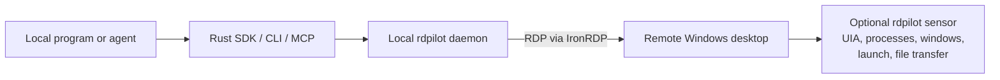

# rdpilot

rdpilot is a Rust toolkit that lets a program or agent running on your machine operate a remote Windows desktop over RDP. A persistent local daemon owns explicitly named sessions and exposes the desktop through a Rust SDK, CLI, and stdio MCP server; callers can capture framebuffer screenshots and send mouse or keyboard input, while a small optional Windows sensor adds window, process, and UI Automation data, process launch, and file transfer. The controller stays local, and files cross the session only when a transfer is requested.

## What it provides

- Persistent RDP sessions, managed by a local daemon and addressed explicitly by session ID.
- Full-desktop screenshots and mouse, keyboard, scroll, and drag input.
- Correlated world state plus window, process, and UI Automation inspection when the sensor is configured.
- Remote process launch, foreground-window control, and checksum-verified file transfer through RDP drive redirection and the sensor.
- Human-readable or JSON CLI output, and twelve MCP tools including an Anthropic-compatible `computer` tool. See the [MCP tool contract](crates/rdpilot-mcp/README.md) for the complete surface.

The remote target is Windows-only. The sensor is a self-contained, win-x64 .NET 8 NativeAOT executable deployed through the RDP connection. The current supported installation is session-management-only without it (`connect`, `list`, and `disconnect`); configure the sensor before relying on perception, input, launch, or transfer commands.



This is a different fit from a conventional VNC viewer: rdpilot is an embeddable, agent-facing RDP client stack that combines pixels with structured Windows state. If a person simply needs to see and control another desktop, a standard VNC/RFB or remote-support client is usually the more direct tool.

## Install

Download the release for your platform from the [rdpilot Releases page](https://github.com/chispa-sideral/rdpilot/releases), then extract its contents without changing their layout. Keep `rdpilot` and `rdpilot-daemon` in the same directory: the CLI starts its daemon by locating that sibling binary, not by searching `PATH`. Add that directory to `PATH` if desired.

Create the configuration file at `~/.config/rdpilot/config.toml` on Unix or `%APPDATA%\rdpilot\config.toml` on Windows. The [configuration template](crates/rdpilot-config/assets/config.toml.template) documents every key and its precedence: config file, `RDPILOT_*` environment variables, then CLI flags or MCP parameters. Set the host and credentials there or through the environment. Passwords in the file are plaintext, so keep it private and never commit a populated copy. Certificate validation remains enabled unless you explicitly change it.

For perception, input, launch, and transfer, configure `sensor_binary_path` to the matching released Windows sensor executable. Without it, rdpilot supports session management only.

## Use the CLI

Once host and credentials are configured:

```sh
rdpilot connect --name lab
rdpilot list
rdpilot perceive screenshot --session lab --output desktop.png
rdpilot perceive world-state --session lab --screenshot --window-list \
  --uia-mode foreground --output desktop.png
rdpilot disconnect --session lab
```

Run `rdpilot --help` or the help for a subcommand to see input, process, window, and file operations. Every command that acts on a desktop requires `--session`; `connect` creates a session and `list` enumerates them.

## Use MCP

Configure your MCP host to launch the matching released `rdpilot-mcp` binary beside the CLI and daemon. It is a thin local client: every tool call goes over local IPC to the daemon, which owns the live RDP connections. Connection settings use the same config and environment variables as the CLI.

> **Trust boundary:** `rdpilot_put` can read any local path readable by the daemon, and `rdpilot_get` can write any local path writable by it. The MCP server does not enforce a path sandbox. Expose these tools only through a trusted host with suitable approvals, path controls, or a restricted OS account; do not make them available to untrusted prompt sources. See the [full MCP security note](crates/rdpilot-mcp/README.md#trust-model-developer-decision--read-before-exposing-this-server-to-an-untrusted-prompt-source).

## Alternatives

These tools solve adjacent problems; the choice is about where the automation runs and which interface it needs.

| Choose | When it fits | Why not rdpilot for that job? |
| --- | --- | --- |
| A [VNC/RFB](https://www.rfc-editor.org/rfc/rfc6143) client | Straightforward interactive remote viewing and control | rdpilot is a programmable RDP stack, not a general-purpose human viewer. |
| [Apache Guacamole](https://guacamole.apache.org/doc/gug/introduction.html) | Browser access through an RDP/VNC/SSH gateway | Guacamole supplies a web application and gateway; rdpilot supplies a local SDK and agent-facing daemon, CLI, and MCP interfaces. |
| [Playwright](https://playwright.dev/docs/intro) | Browser automation with DOM-level access | It targets web content, not arbitrary native Windows applications reached through RDP. |
| [WinAppDriver](https://github.com/microsoft/WinAppDriver) or Windows UI Automation | UI testing can run as a service on the Windows application host | rdpilot keeps the controller local and obtains structured state from a small remote sensor. |
| [FreeRDP](https://github.com/FreeRDP/FreeRDP) | A C/C++ RDP library or ready-made client is the right foundation | rdpilot specifically wanted Rust-native session, graphics, input, and virtual-channel building blocks without a C FFI boundary in its core. |
| Microsoft's [Remote Desktop ActiveX control](https://learn.microsoft.com/en-us/windows/win32/termserv/remote-desktop-activex-control) | A Windows application needs to embed or customise the Remote Desktop Services UI | It is a Windows UI component, rather than the headless Rust session stack used by rdpilot's daemon and APIs. |

## Dependencies and acknowledgements

rdpilot is built around [IronRDP](https://github.com/Devolutions/IronRDP). Its modular Rust crates provide the connection and session state machines, graphics, input, and static and dynamic virtual-channel pieces that rdpilot embeds directly. The sensor uses an RDP dynamic virtual channel, whose protocol is defined by Microsoft's [MS-RDPEDYC specification](https://learn.microsoft.com/en-us/openspecs/windows_protocols/ms-rdpedyc/3bd53020-9b64-4c9a-97fc-90a79e7e1e06).

Choosing IronRDP over FreeRDP or Microsoft's ActiveX control was a project-specific engineering decision, not a claim of universal superiority: FreeRDP is a mature C/C++ implementation, while the Microsoft control is designed for Windows applications customising the Remote Desktop Services experience. IronRDP matches rdpilot's Rust-native, daemon-oriented integration boundary more closely.

The project also relies on the broader Rust ecosystem, notably [Tokio](https://tokio.rs/), [rustls](https://github.com/rustls/rustls), [Clap](https://github.com/clap-rs/clap), [Serde](https://serde.rs/), and the [Rust MCP SDK](https://github.com/modelcontextprotocol/rust-sdk), plus [.NET 8 NativeAOT](https://learn.microsoft.com/en-us/dotnet/core/deploying/native-aot/) and Windows UI Automation for the sensor. The crate manifests remain the exact dependency inventory.

## License

rdpilot is licensed under the [GNU Lesser General Public License v3.0 or later](LICENSE.md) (`LGPL-3.0-or-later`).
